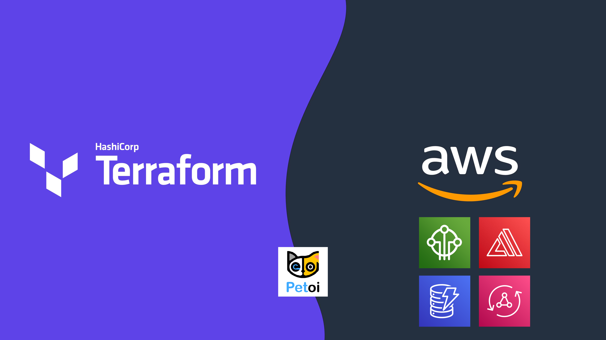

# IoT Puppy Park: Connected Worker Safety with Terraform! 🐶🐾
#### Created by:
[Kevon Mayers](https://www.linkedin.com/in/kevonmayers)

This workshop is a guided example of how you can leverage AWS IoT Core, AWS Amplify, Terraform, and robotics to improve worker safety. The robots used in this workshop are called Petoi Bittle. If you're not familiar with **[Petoi Bittle](https://www.petoi.com/pages/bittle-open-source-bionic-robot-dog?utm_source=google-ads&utm_campaign=&utm_agid=141849525757&utm_term=&gclid=CjwKCAiA_vKeBhAdEiwAFb_nrQYeIL6zf0sH8S0_gRDafo5FqLmbhOD-LMhOhvEq_o5zeaInmnawqBoCe98QAvD_BwE)**, it is a palm-sized, servo-activated quadruped robot dog. It's board (NyBoard) is a based on an Arduino Uno. There are a number of modules you can connect to Bittle, and a main one we are leveraging is the **[ESP8266](https://docs.petoi.com/communication-modules/wifi-esp8266)**. While Bittle comes with a web and mobile app that you can use the included Bluetooth module to issue commands, we have extended upon this to connect Bittle to AWS for added functionality.

We have connected Bittle to **[AWS IoT Core](https://aws.amazon.com/iot-core/)** and have created a serverless full stack **[AWS Amplify](https://aws.amazon.com/amplify/)** App to control Bittle, as well as view live video and other device information for not just one Bittle, but ***an entire fleet of Bittles***. To provide a streamlined and repeatable deployment, we are leveraging **[Terraform](https://www.terraform.io/)** for Infrastructure as Code (IaC). If you are not too familiar with Terraform, don't worry - we have created a custom Terraform module to abstract away most of the complexity down to a few lines of code. For those more experienced with Terraform, feel free to customize and add on to this solution, we are making it completely open-source.

To see this in action, check out **[this video from CERAWeek 2023 in Houston, TX](https://www.youtube.com/watch?v=rT07VTBF2jg)**.

 For getting started quickly, check out some of our provided **[code examples](https://github.com/novekm/iot-puppy-park/tree/main/terraform-deployment/examples)**.

 For detailed information and step-by-step guidance, check out the full workshop on **[AWS Workshop Studio](https://workshops.aws/).**
 // TODO - Update this with public URL when it is out

